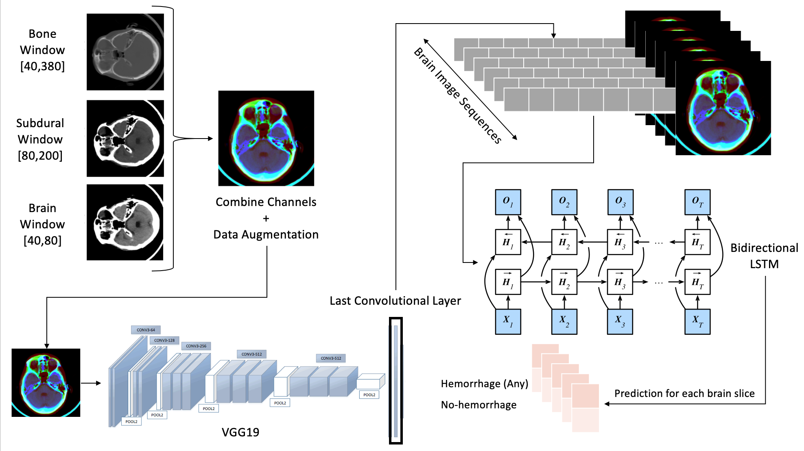

# hemorrhage-detection

This repository contains our implementation and training of a combined recurrent-convolutional DNN for intracranial hemorrhage (bleeding inside the brain) detection on CT scans.

The architecture that we have developed **vastly outperforms** the standard convolution-only approach: Our model achieves a recall (that is, it correctly detects bleeding) of 94% compared to a recall of 73% when only using a CNN.

The bidirectional recurrent neural network enables our model to incorporate information from CT slices of the brain above *and* below the current slice when predicting whether the current slice contains a hemorrhage or not. Of course, surrounding slices containing hemorrhages make it more likely for the current slice to also contain one (especially when the slices right above *and* right below show bleeding).

This work is a collaboration of Richard Qiu, Philippe Noël, Jonathan Berman, and Jorma Görns.

## Contents

* "EDA and Data Preprocessing.ipynb": **DESCRIPTION**

* "Windowing PNGs.ipynb": When examining brain CT scans, radiologists rarely look at the raw images (they appear mostly gray to the human eye). Instead, they use so-called "windows"---simple transformations of the raw data that serve to highlight structures of different density in the human brain. The three most common windows for hemorrhage detection are the **bone, brain, and subdural window**. These are also the three windows that we apply to help our model detect hemorrhages. Specifically, we read in black-and-white, one-channel PNGs and turn them into RGB, three-channel PNGs where each channel contains one specific window.

* "**MISSING NAME**.ipynb": **DESCRIPTION**

* "Training the CNN.ipynb": Details the training of our feature extractor (specifically, a VGG19 CNN that we train to detect hemorrhages using transfer learning)

* "Training the R-CNN.ipynb": Details the training of our final model, an *LSTM* using features extracted by the CNN

* Finally, the *docs* folder also contains a verbal report of this project.
